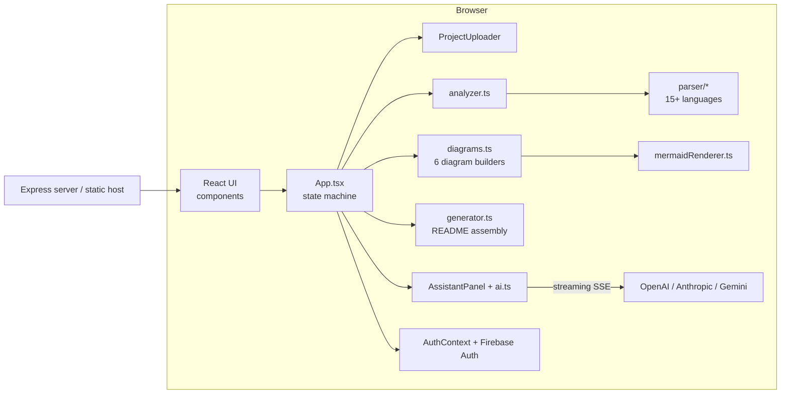

# CogniCode — README Studio

[](https://www.typescriptlang.org/)
[](https://react.dev/)
[](https://vitejs.dev/)
[](https://tailwindcss.com/)
[](https://mermaid.js.org/)
[](https://firebase.google.com/)
[](https://expressjs.com/)
[](LICENSE)
[](https://github.com/nobitax44x-afk/cognicode/pulls)

> **Turn any codebase into a stunning `README.md`** — CogniCode uploads your project **entirely in the browser**, analyzes it with built-in multi-language parsers, generates **six Mermaid architecture diagrams**, and assembles a professional README you can copy or download in seconds.

---

## Table of Contents

- [Project Overview](#project-overview)
- [Features](#features)
- [Architecture](#architecture)
- [Folder Structure](#folder-structure)
- [Technology Stack](#technology-stack)
- [Installation](#installation)
- [Environment Variables](#environment-variables)
- [Configuration](#configuration)
- [Scripts](#scripts)
- [Development Workflow](#development-workflow)
- [Deployment](#deployment)
- [Authentication](#authentication)
- [Database](#database)
- [API Documentation](#api-documentation)
- [Screenshots](#screenshots)
- [Project Structure Tree](#project-structure-tree)
- [Known Issues](#known-issues)
- [Future Improvements](#future-improvements)
- [Contributing](#contributing)
- [License](#license)
- [Credits](#credits)
- [FAQ](#faq)
- [Troubleshooting](#troubleshooting)

---

## Project Overview

**CogniCode** is a client-side web application that generates professional GitHub `README.md` files from an uploaded codebase. Everything — file reading, parsing, diagram generation, and Markdown assembly — runs **in the browser**: uploaded source code never leaves the user's device. Optional AI refinement is powered by **bring-your-own API keys** (OpenAI-compatible, Anthropic, or Google Gemini), which are stored only in the user's browser.

The product targets developers who want consistent, well-structured repository documentation without manual Markdown authoring. A guided pipeline (`Upload → Analyze → Diagrams → Build → Ready`) turns a folder or ZIP archive into a complete README with badges, table of contents, stats, project structure, and embedded Mermaid diagrams.

### Key numbers (v2.0.1)

| Metric | Value |
| --- | --- |
| Frontend framework | React 19 + TypeScript 5.8 + Vite 6 |
| Styling | Tailwind CSS 4 (design tokens, light/dark mode) |
| Source files | 75+ (≈9,000 lines) |
| Supported source languages (parsers) | 15+ (TS/JS, Python, Go, Rust, Java/Kotlin, C#, PHP, Ruby, C/C++, Swift, Dart, Vue, Svelte) |
| Auto-generated diagrams | 6 (Architecture, Class, Sequence, Data Flow, ER, State) |
| Auth providers | Email/Password, Google, GitHub (Firebase Auth) |
| AI providers | OpenAI-compatible, Anthropic, Gemini (streaming, BYO key) |

## Features

- **📁 Multi-mode upload** — drag & drop files, pick a folder, or extract a ZIP archive (JSZip). Guards: max 200 files, 10 MB/file, 60 MB total; automatic `node_modules`, `.git`, `dist` and other junk-directory exclusion.
- **🔍 Client-side project analysis** — package-manager, language, tech-stack and license detection; entry-point and HTTP-endpoint discovery; config-file and test-file detection; ASCII project-structure tree.
- **🧩 Multi-language source parsers** — regex-based parsers extract modules, imports, exports, classes, interfaces, enums, methods, properties and inheritance for 15+ languages.
- **📊 Six auto-generated Mermaid diagrams** — Architecture (import graph with directory clusters, cycle highlighting), Class, Sequence, Data Flow, ER, and State diagrams — with **automatic syntax repair** and SVG/PNG export.
- **📝 README generator** — 9 toggleable sections (Overview, Features, Installation, Usage, Configuration, API Reference, Contributing, License, Contact), badges, table of contents, stats table, structure block, license, author and repository metadata, optional emoji headers.
- **🤖 AI assistant** — streaming chat that rewrites the README conversationally; full-document suggestions are shown as a **line diff** with Accept/Reject; provider, model and base URL configurable; keys stay in the browser.
- **✏️ Markdown studio** — split edit/preview workspace with GitHub-style rendering (react-markdown + GFM) and live Mermaid rendering.
- **🔐 Authentication** — Firebase Auth with email/password, Google and GitHub; session or local persistence; friendly error messages; protected workspace gate.
- **🎨 Design system** — Tailwind 4 CSS-variable design tokens, light/dark theme with `prefers-color-scheme` fallback, accessible components (skip link, ARIA labels, keyboard support), responsive layouts.
- **🧪 Sample projects** — one-click demos (TypeScript CLI, Python FastAPI, Go CLI) so users can try the generator without uploading.

## Architecture

CogniCode is a **single-page application with no backend dependency**. The server (`server.ts`) exists only to serve the built bundle and a health endpoint — all product logic is client-side.



**Pipeline:** `upload → analyze → diagrams → build → ready` (see `ProgressFlow.tsx`). Analysis runs synchronously over the uploaded file set; diagrams are generated from the resolved import graph (with SCC cycle detection); the README is assembled from `ProjectAnalysis` + `ReadmeOptions` + selected diagrams.

See **[docs/ARCHITECTURE.md](docs/ARCHITECTURE.md)** for the full architectural documentation and **[docs/DIAGRAMS.md](docs/DIAGRAMS.md)** for the complete diagram suite (Mermaid + PlantUML).

## Folder Structure

```text
cognicode/
├── src/
│   ├── components/      # 24 UI components (landing + workspace + auth)
│   ├── context/         # AuthContext (Firebase auth state + actions)
│   ├── data/            # Sample projects for one-click demos
│   ├── firebase/        # Firebase app/auth initialization
│   ├── hooks/           # useAuth, useTheme, useAiConfig
│   ├── lib/
│   │   ├── parser/      # Language parsers (js, py, go, rs, java, cs, rb, php, misc)
│   │   ├── analyzer.ts  # Project analysis engine
│   │   ├── diagrams.ts  # 6 Mermaid diagram generators
│   │   ├── generator.ts # README markdown assembly
│   │   ├── ai.ts        # Streaming AI clients (OpenAI/Anthropic/Gemini)
│   │   ├── mermaid*.ts  # Renderer, theme, auto-repair
│   │   ├── diagramExport.ts  # SVG/PNG export
│   │   └── utils.ts     # Shared utilities
│   ├── pages/           # Standalone pages (Login/Profile/Settings — reserved)
│   ├── App.tsx          # Root state machine (landing ⇄ workspace)
│   ├── main.tsx         # Entry point
│   ├── types.ts         # Domain types + README section definitions
│   └── index.css        # Design tokens + component classes
├── server.ts            # Express static server + /api/health
├── vite.config.ts       # Vite + React + Tailwind plugins
├── tsconfig.json
├── firestore.rules      # Restrictive Firestore rules (unused by app yet)
├── index.html           # SPA shell with theme bootstrapping
├── preview.html         # Standalone GitHub-style preview (vendor/ libs)
└── package.json
```

## Technology Stack

| Layer | Technology | Purpose |
| --- | --- | --- |
| UI | React 19, TypeScript 5.8 | Component architecture, type safety |
| Build | Vite 6, esbuild | Dev server, production bundling, server bundling |
| Styling | Tailwind CSS 4, custom CSS tokens | Design system, light/dark themes |
| Diagrams | Mermaid 11 | Client-side diagram rendering |
| Markdown | react-markdown 10, remark-gfm | README preview rendering |
| Animation | motion 12 (framer-motion) | Micro-interactions, drawers |
| Icons | lucide-react | Icon set |
| Archives | JSZip 3 | ZIP upload extraction |
| Auth | Firebase 12 (Auth) | Email/password, Google, GitHub |
| Server | Express 4, dotenv | Static hosting + health endpoint |
| AI | Fetch + SSE (no SDK) | OpenAI-compatible / Anthropic / Gemini streaming |

## Installation

### Prerequisites

- **Node.js 18+** (20 LTS recommended)
- **npm 9+** (or pnpm/yarn — lockfile is `package-lock.json`)
- A Firebase project for authentication (optional for local demo; required for sign-in)

### Getting started

```bash
# 1. Clone the repository
git clone https://github.com/nobitax44x-afk/cognicode.git
cd cognicode

# 2. Install dependencies
npm install

# 3. Start the development server
npm run dev          # tsx server.ts  → http://localhost:3000
# — or, for Vite HMR during UI work:
npx vite             # → http://localhost:5173
```

> **Note:** `npm run dev` serves the **built** bundle through Express (see [Scripts](#scripts)). For hot module replacement while editing components, use `npx vite`. To serve the app through Express during development, run `npm run build && npm run dev` first.

## Environment Variables

Copy `.env.example` to `.env.local`:

```bash
VITE_AI_PROVIDER=openai          # openai | anthropic | gemini
VITE_AI_MODEL=your-model-name    # e.g. gpt-4o-mini
VITE_AI_API_KEY=your-api-key-here
VITE_AI_BASE_URL=https://your-endpoint/v1   # optional OpenAI-compatible endpoint
```

| Variable | Required | Description |
| --- | --- | --- |
| `VITE_AI_PROVIDER` | No | Default AI provider pre-filled in settings |
| `VITE_AI_MODEL` | No | Default model (falls back to provider default, e.g. `gpt-4o-mini`) |
| `VITE_AI_API_KEY` | No | Default API key (⚠️ Vite embeds `VITE_*` vars into the client bundle — prefer leaving keys empty and letting users add their own in the UI) |
| `VITE_AI_BASE_URL` | No | OpenAI-compatible base URL override |
| `VITE_GEMINI_API_KEY` | No | Convenience default for Gemini |
| `PORT` | No (server) | Express port (default `3000`) |
| `HOST` | No (server) | Bind address (default `0.0.0.0`) |

## Configuration

| Concern | Where | Details |
| --- | --- | --- |
| AI provider defaults | `.env.local` | Read by `useAiConfig.ts`; UI overrides stored in `localStorage['cognicode-ai-config']` |
| Theme | `localStorage['cognicode-theme']` | `light` / `dark`; falls back to `prefers-color-scheme`; bootstrapped in `index.html` to avoid flash |
| Firebase project | `src/firebase/firebase.ts` | Hardcoded config object (public by design for Firebase web apps) |
| Upload limits | `ProjectUploader.tsx` | `MAX_FILES = 200`, `MAX_FILE_SIZE = 10 MB`, `MAX_TOTAL_SIZE = 60 MB`; skip-list for `node_modules`, `.git`, `dist`, etc. |
| README options | Workspace sidebar + `ReadmeSettingsModal` | Sections, badges, ToC, stats, structure, emoji headers, license, author, repo URL, install/usage commands |
| Vite host allow-list | `vite.config.ts` | `allowedHosts: ['.monkeycode-ai.live']` — add your preview domains |

## Scripts

| Script | Command | Description |
| --- | --- | --- |
| `dev` | `tsx server.ts` | Run the Express server (serves `dist/` if built) |
| `build` | `vite build && esbuild server.ts …` | Build client bundle + bundle server to `dist/server.cjs` |
| `start` | `node dist/server.cjs` | Run the production server |
| `clean` | `rm -rf dist` | Remove build output |
| `lint` | `tsc --noEmit` | Type-check the whole project |

## Development Workflow

1. **Branch** — create a feature branch (`git checkout -b feature/...`).
2. **Develop** — run `npx vite` for HMR; keep components in `src/components`, domain logic in `src/lib`.
3. **Type-check** — `npm run lint` (`tsc --noEmit`).
4. **Build** — `npm run build`; smoke-test the bundle with `npm start`.
5. **Commit** — conventional messages; the repo uses an MIT-style contribution flow (fork → PR).
6. **Test** — no automated suite yet; run the manual test matrix in [docs/TESTING.md](docs/TESTING.md) (vitest/jsdom/playwright are pre-installed for the planned suite).

## Deployment

### Option A — Express server (Node)

```bash
npm ci
npm run build
npm start          # listens on 0.0.0.0:3000 (PORT/HOST overridable)
```

Serves `dist/` with SPA fallback and exposes `GET /api/health`.

### Option B — Static hosting (recommended for zero-ops)

The client is a pure static bundle — deploy `dist/` to **Vercel**, **Netlify**, **Firebase Hosting**, **Cloudflare Pages**, or any static host:

```bash
npm ci && npm run build
# upload dist/ ; add SPA rewrite: /* → /index.html
```

### Firebase setup

1. Create a Firebase project; enable **Authentication** (Email/Password, Google, GitHub).
2. Add your web app; replace the config in `src/firebase/firebase.ts`.
3. Add your deployment domains to **Authorized domains** (Authentication → Settings) — otherwise popup sign-in fails with `auth/unauthorized-domain`.
4. (Optional) Deploy `firestore.rules` if you enable Cloud Firestore later: `firebase deploy --only firestore:rules`.

See **[docs/DEPLOYMENT.md](docs/DEPLOYMENT.md)** for the full deployment guide.

## Authentication

Firebase Auth via `AuthContext` (`src/context/AuthContext.tsx`):

- **Methods:** email/password, Google popup, GitHub popup.
- **Persistence:** `browserLocalPersistence` (remember me) or `browserSessionPersistence`.
- **Flow:** the workspace is auth-gated — uploading a project or loading a sample while signed out opens `AuthModal`; the pending action resumes automatically after successful sign-in (`pendingRef` in `App.tsx`).
- **Error handling:** `getFriendlyErrorMessage()` maps Firebase error codes to human-readable messages.
- **Profile:** `AuthUser` (uid/email/displayName/photoURL/providers) from `onAuthStateChanged`; `userProfile` currently returns a static `{ role: 'Member' }` (no Firestore sync yet — see [Known Issues](#known-issues)).

## Database

CogniCode has **no server-side database**. Persistent state lives in the browser:

| Key | Content |
| --- | --- |
| `localStorage['cognicode-ai-config']` | AI provider/model/key/base URL (JSON `AIConfig`) |
| `localStorage['cognicode-theme']` | `light` / `dark` |
| Firebase Auth | User identity (uid, email, display name, photo URL) |
| In-memory | `UploadedFile[]`, `ProjectAnalysis`, `ReadmeOptions`, `DiagramDef[]`, `ChatMessage[]` |

`firestore.rules` ships locked-down default rules (`allow read: if request.auth.uid == uid` for own profile; no client writes) ready for future profile/documentation persistence. See **[docs/DATABASE.md](docs/DATABASE.md)**.

## API Documentation

**Server endpoints:**

| Method | Path | Description |
| --- | --- | --- |
| `GET` | `/api/health` | Liveness: service, version, uptime, timestamp |
| `GET` | `/*` | Static bundle + SPA fallback |

**Client library surface** (all exported from `src/lib`): `analyzeFiles()` → `ProjectAnalysis`; `generateDiagrams(analysis, files)` → `DiagramDef[]` (6 kinds); `generateReadme(analysis, options, diagrams)` → markdown string; `streamChat({config, system, messages, onToken})` → SSE streaming to OpenAI-compatible/Anthropic/Gemini; `exportAllDiagrams(diagrams)` → SVG+PNG downloads; `renderMermaid(source, theme)` → SVG string.

**External APIs consumed:** Firebase Auth REST (via SDK), OpenAI Chat Completions (`/v1/chat/completions`, SSE), Anthropic Messages (`/v1/messages`, SSE, requires `anthropic-dangerous-direct-browser-access`), Gemini (`streamGenerateContent?alt=sse`).

See **[docs/API.md](docs/API.md)** for the complete reference.

## Screenshots

| Landing | Workspace — diagrams | AI assistant diff |
| --- | --- | --- |
| `docs/screenshots/landing.png` *(placeholder)* | `docs/screenshots/workspace.png` *(placeholder)* | `docs/screenshots/assistant.png` *(placeholder)* |

## Project Structure Tree

```text
cognicode/
├── server.ts                      # Express static server + /api/health
├── vite.config.ts                 # Vite + React + Tailwind
├── tsconfig.json                  # TS 5.8 strict-ish config
├── index.html                     # SPA shell + theme bootstrap
├── preview.html                   # Standalone GitHub-style README preview
├── firestore.rules                # Locked-down Firestore rules
├── .env.example                   # AI provider env template
├── package.json / package-lock.json
└── src/
    ├── main.tsx                   # React root + mermaid warm-up
    ├── App.tsx                    # View state machine (landing ⇄ workspace)
    ├── types.ts                   # Domain types + SECTION_DEFS + DEFAULT_OPTIONS
    ├── index.css                  # Design tokens, buttons, inputs, md-preview
    ├── components/                # 24 components (see Folder Structure)
    ├── context/AuthContext.tsx    # Firebase auth provider + friendly errors
    ├── data/sampleProjects.ts     # 3 demo projects
    ├── firebase/firebase.ts       # Firebase init
    ├── hooks/                     # useAuth · useTheme · useAiConfig
    ├── lib/
    │   ├── analyzer.ts            # Project analysis engine
    │   ├── diagrams.ts            # 6 diagram generators + import graph
    │   ├── generator.ts           # README markdown assembly
    │   ├── ai.ts                  # Streaming AI clients
    │   ├── diagramExport.ts       # SVG/PNG export
    │   ├── mermaidRenderer.ts     # Mermaid init/cache/queue
    │   ├── mermaidRepair.ts       # Syntax repair + safe quoting
    │   ├── mermaidTheme.ts        # Theme variables + renderMermaid()
    │   ├── utils.ts               # bytes, ids, slugs, files, clipboard
    │   └── parser/                # js · python · go · rust · java · csharp · php · misc
    └── pages/                     # Login / Profile / Settings (reserved pages)
```

## Known Issues

1. **Orphaned pages** — `src/pages/Login.tsx`, `Profile.tsx`, `Settings.tsx`, and the `ResultPanel` component are fully implemented but **not wired into the app** (auth uses `AuthModal`). They are preserved as reserved pages; wire them up or remove them.
2. **No automated tests** — `vitest`/`jsdom`/`playwright` are declared in `devDependencies` but no test suite exists yet; only manual QA has been performed.
3. **Unused dependency** — `@google/genai` is not imported anywhere; safe to remove (`npm uninstall @google/genai`).
4. **`userProfile` is static** — the role is hardcoded to `Member`; Firestore profile sync is not implemented (rules are ready).
5. **AI keys in `localStorage`** — by design (BYO-key), but any XSS would expose keys; the app renders Markdown with default react-markdown escaping (HTML is not executed) and Mermaid runs with `securityLevel: 'strict'`.
6. **OpenAI browser-direct calls** — some OpenAI-compatible providers allow CORS; for strict providers use `VITE_AI_BASE_URL` with a proxy/relay endpoint.
7. **Duplicate legacy labels** — `WorkspaceLayout` previously rendered two identical "README settings" buttons (fixed in v2.0.1).

## Future Improvements

- Wire the reserved **Profile/Settings pages** into the workspace (avatar, diagram theme, notifications).
- Add **automated tests** (vitest + Testing Library for components, Playwright E2E for the pipeline).
- **Firestore-backed** user profiles and saved documentation projects (rules already shipped).
- **Server-side analysis worker** for very large repositories (Web Worker offload).
- **More parsers**: Kotlin specifics, Terraform, SQL, LaTeX; AST-based parsing (tree-sitter) for higher accuracy.
- **Diagram exports as PDF/PNG at scale**, dark-mode-safe exports.
- i18n (at least `en`/`bn`), PWA offline support, and `vite-plugin-pwa`.
- GitHub Actions CI (`lint + typecheck + test + build`) — `hasCIConfig` detection already exists in the analyzer.

## Contributing

Contributions are welcome!

1. Fork the repository.
2. Create your feature branch: `git checkout -b feature/amazing-feature`.
3. Commit your changes: `git commit -m "feat: add amazing feature"`.
4. Push: `git push origin feature/amazing-feature`.
5. Open a Pull Request.

Please ensure `npm run lint` passes and add tests when introducing new behavior.

## License

Distributed under the **MIT** license. See `LICENSE` for more information.

## Credits

- **Author / maintainer:** Bornil Mahmud (*Nightmare*) — [GitHub](https://github.com/BornilMahmud) · bornilprof@gmail.com
- **Open source:** React, Vite, Tailwind CSS, Mermaid, Firebase, Express, lucide-react, motion, react-markdown, JSZip.
- Generated docs: full project analysis, QA and documentation suite in `docs/`.

## FAQ

**Does my code leave the browser?** No — uploads are read in-memory (FileReader/JSZip) and analyzed client-side. Only the AI assistant sends *your README text* (never the uploaded files) to the provider you configure.

**Where is the API key stored?** In `localStorage` under `cognicode-ai-config`, only in your browser. Clearing site data removes it.

**Which AI providers work?** OpenAI-compatible endpoints (OpenAI, DeepSeek, Groq, OpenRouter…), Anthropic, and Google Gemini. Anthropic requires the special `anthropic-dangerous-direct-browser-access` header (already sent).

**Why is the workspace gated behind login?** Authentication is required before uploading (anti-abuse + per-user analytics). Sample projects also require sign-in.

**Can I use it offline?** After the first load (which fetches fonts), the core pipeline works offline; AI features need network.

## Troubleshooting

| Symptom | Cause / Fix |
| --- | --- |
| `auth/unauthorized-domain` on sign-in | Add your domain to Firebase Console → Authentication → Settings → Authorized domains |
| `npm run dev` exits immediately | `dist/` is missing — run `npm run build` first, or use `npx vite` for HMR |
| Popup sign-in blocked | Allow popups for the site; popups may fail inside sandboxed iframes — use email/password |
| AI assistant errors | Check the key/model in **AI settings**; ensure the provider supports CORS or set `VITE_AI_BASE_URL` |
| Mermaid diagram shows error text | The auto-repair ran out of strategies; regenerate diagrams after re-upload |
| Upload rejected | Respect limits: ≤200 files, ≤10 MB/file, ≤60 MB total; zip archives are unpacked automatically |
| `localStorage` settings lost | Site data was cleared; reconfigure theme/AI key |

---

<p align="center">Generated with CogniCode · Built by <a href="https://github.com/BornilMahmud">Nightmare</a></p>
