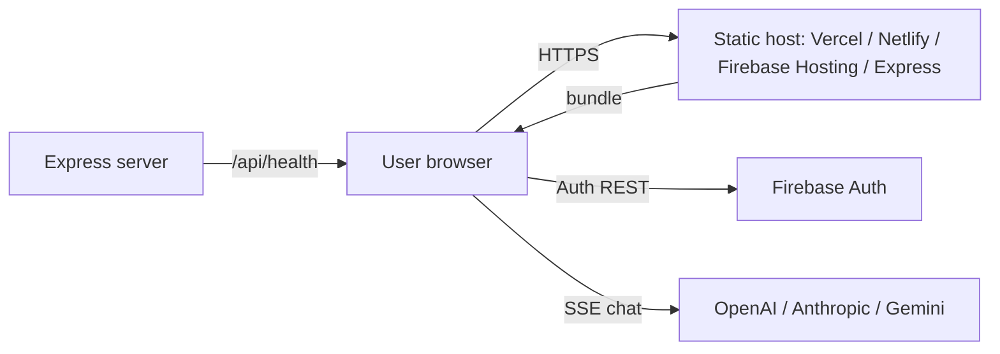

# CogniCode — Architecture Documentation

> Companion to `docs/DIAGRAMS.md` (visual diagrams) and `docs/API.md` (function reference). This document describes the system architecture as implemented in **v2.0.1**, grounded in the actual source code.

---

## 1. Architectural Style

CogniCode is a **Single-Page Application (SPA)** with a **client-centric layered architecture**:

```
┌───────────────────────────── Browser ─────────────────────────────┐
│  Presentation Layer    — React components (landing, workspace,    │
│                          auth modals)                              │
│  Application Layer     — App.tsx state machine, contexts, hooks   │
│  Domain Layer          — analyzer, parsers, diagrams, generator,  │
│                          ai (pure TS, no React)                   │
│  Infrastructure Layer  — Firebase Auth, localStorage, provider    │
│                          APIs (SSE), Mermaid renderer             │
└───────────────────────────────────────────────────────────────────┘
                 │ static bundle + /api/health
┌────────────────▼───────────────────────────────────────────────────┐
│  Express server (server.ts) — optional; also any static host       │
└────────────────────────────────────────────────────────────────────┘
```

**Key decision:** all product logic runs in the browser. The Express server only serves the built bundle and exposes `GET /api/health`. There is no database, no session store, and no file-upload API — the upload pipeline is purely client-side (FileReader / JSZip).

## 2. Module Map (dependency direction)

```
main.tsx ──▶ App.tsx ──▶ components/*
   │             │
   │             ├──▶ context/AuthContext ──▶ firebase/firebase ──▶ Firebase SDK
   │             ├──▶ hooks/useAiConfig ──▶ lib/ai (defaultModelFor)
   │             ├──▶ hooks/useTheme
   │             ├──▶ lib/analyzer ──▶ lib/parser/*
   │             ├──▶ lib/diagrams ──▶ lib/mermaidRepair
   │             ├──▶ lib/generator
   │             ├──▶ lib/mermaidRenderer ──▶ mermaidTheme · mermaidRepair
   │             ├──▶ lib/diagramExport ──▶ mermaidRenderer
   │             └──▶ data/sampleProjects
   └── types.ts  (shared domain types; no runtime deps)
```

- **`types.ts`** is the contract layer: `UploadedFile`, `ProjectAnalysis`, `ModuleNode`, `ClassInfo`, `DiagramDef`, `ReadmeOptions`, `AIConfig`, `ChatMessage`, `SECTION_DEFS`, `DEFAULT_OPTIONS`.
- **No circular imports** exist between `lib` modules: `analyzer → parser`, `diagrams → mermaidRepair`, `generator → types`, `ai → types`, `mermaidRenderer → {mermaidTheme, mermaidRepair}`, `mermaidTheme → mermaidRenderer` (a single deliberate cycle: `renderMermaid()` re-exports `renderMermaidCached()`; harmless but noted).

## 3. Application State Model

| State | Owner | Persistence |
| --- | --- | --- |
| `view: 'landing' \| 'workspace'` | `App.tsx` | — |
| `pipeline: upload→analyze→diagrams→build→ready` | `App.tsx` | — |
| `files: UploadedFile[]` | `App.tsx` | memory only |
| `analysis: ProjectAnalysis \| null` | `App.tsx` | derived from files |
| `diagrams: DiagramDef[]` | `App.tsx` | derived from analysis |
| `readme: string` | `App.tsx` | memory; exported on demand |
| `options: ReadmeOptions` | `App.tsx` | memory |
| `AuthUser \| null` | `AuthContext` | Firebase session |
| `AIConfig \| null` | `useAiConfig` | `localStorage['cognicode-ai-config']` |
| `Theme` | `useTheme` | `localStorage['cognicode-theme']` |
| toasts | `ToastProvider` | memory |

State flows one way: uploads → `runAnalysis` → `analysis` + `diagrams` → `generateReadme(options, diagrams)` → `readme`. Toggling a diagram or changing options after generation triggers an immediate re-render of the README (`handleToggleDiagram`).

## 4. Analysis Pipeline

```
UploadedFile[] ──▶ analyzeFiles() ──▶ ProjectAnalysis
                     ├ detectPackageManager()    (lockfile/manifest presence)
                     ├ detectLanguage()          (byte-count per extension)
                     ├ parsePackageJson()        (name, description, license, deps)
                     ├ framework/tool maps       (dep name → TechItem)
                     ├ buildStructure()          (ASCII tree, depth 2, 24 entries)
                     ├ extractCodeInfo()         (per-file: parseFile → ModuleNode,
                     │                            ClassInfo, entry points, endpoints)
                     └ diagnostics               (filesScanned, parserErrors, …)

ProjectAnalysis + UploadedFile[] ──▶ generateDiagrams() ──▶ DiagramDef[6]
                     ├ buildEdgeIndex()          (path → file, dir index)
                     ├ candidatesFor()           (per-language spec resolution)
                     ├ resolveGraph()            (edges + Tarjan SCC cycles)
                     ├ architectureDiagram()     (≤32 nodes, ≤40 edges, clusters)
                     ├ classDiagram()            (≤16 classes, inheritance/implements)
                     ├ sequenceDiagram()         (entry → handler → data)
                     ├ flowDiagram()             (input → entry → … → output)
                     ├ erDiagram()               (≤6 model entities + relationships)
                     └ stateDiagram()            (entry chain lifecycle)
```

## 5. README Generation

`generateReadme(analysis, options, diagrams)` is a pure function returning the final markdown. Composition order:

1. `# Title` + badges (if enabled)
2. Description
3. Table of Contents (sections + diagram titles)
4. Overview (stats table, structure block — if enabled)
5. Selected diagrams (each as ` ```mermaid ` fenced block)
6. Features (derived from analysis)
7. Installation (prerequisites + install command)
8. Usage (instructions + command)
9. Configuration (detected config files)
10. API Reference (detected endpoints as a table)
11. Contributing, License, Contact
12. CogniCode footer

## 6. AI Assistant Flow

```
User message
  └─▶ AssistantPanel.send()
       ├─ no config? ──▶ open AI settings modal
       ├─ streamChat({config, system, messages, onToken, signal})
       │    ├─ openai:   POST {baseUrl}/chat/completions   (SSE)
       │    ├─ anthropic: POST https://api.anthropic.com/v1/messages (SSE)
       │    └─ gemini:    GET/POST streamGenerateContent?alt=sse
       ├─ onToken → append to assistant message
       └─ looksLikeReadme(full)? ──▶ onSuggest(full) ──▶ DiffView ──▶ accept/reject
```

The system prompt embeds `projectSummaryOf(analysis)` (name, description, language, file/line counts, entry point, detected endpoints) and the current README.

## 7. Mermaid Rendering & Resilience

- `warmUpMermaid()` preloads the dynamic `import('mermaid')` at boot.
- `renderMermaidCached(source, theme)` caches by `(theme, source)`; a promise queue serializes renders (Mermaid is not concurrency-safe).
- Every generated diagram is pre-validated with `mermaid.parse()`; on failure, `repairMermaid()` tries four strategies (drop offending line, drop bare `class/interface/enum` openers, dedupe identical edges, collapse whitespace) and re-validates before rendering.
- Theme variables come from `mermaidThemeVariables(theme)`; `securityLevel: 'strict'`.

## 8. Auth Flow

```
AuthModal (login/register tabs)
  ├─ LoginForm  ──▶ loginWithEmail / loginWithGoogle / loginWithGithub
  ├─ RegisterForm ─▶ signupWithEmail (+updateProfile displayName)
  └─ ForgotPasswordModal ─▶ resetPassword (email link)
        └─▶ AuthContext ──▶ firebase/auth
              └─ onAuthStateChanged ──▶ AuthUser → App re-render
```

Workspace gating: `handleFilesRead`/`handleLoadSample` stash the pending action in `pendingRef` and open `AuthModal`; `handleAuthSuccess` replays it. The `useEffect` in `AppInner` returns signed-out users to the landing view.

## 9. Design System

- **Tokens:** CSS custom properties (`--app-*`) defined in `:root` (light) and `.dark` (dark); exposed to Tailwind via `@theme inline` (`--color-app-*`, `--shadow-app-*`, fonts).
- **Component classes:** `.btn` (+ `-primary/-secondary/-ghost/-danger`), `.input`, `.card`, `.field-label`, `.app-container`, `.md-preview` (GitHub-style typography).
- **Theme bootstrapping:** an inline script in `index.html` applies the stored/system theme before first paint (avoids FOUC).
- **Accessibility:** skip-to-content link, ARIA roles for tabs/switch/checkbox/dialog/progressbar, `aria-live` for toasts and upload status, Escape-to-close on modals/drawers, keyboard focusable controls.

## 10. Deployment Topology



Two supported topologies: **(A)** static hosting of `dist/` (recommended), **(B)** the bundled Express server (`dist/server.cjs`) with SPA fallback.

## 11. Known Architectural Debt

1. `mermaidTheme.ts` imports from `mermaidRenderer.ts` while `mermaidRenderer.ts` imports `mermaidThemeVariables` from `mermaidTheme.ts` — a benign cycle; extract theme variables into a third module to remove it.
2. Orphaned pages (`Login`, `Profile`, `Settings`) duplicate auth UX that `AuthModal` already provides; wire them into a future router or delete.
3. `userProfile` is a static `{ role: 'Member' }` — the Firestore schema is prepared (`firestore.rules`) but not implemented.
4. `App.tsx` is the single state machine (475 lines) — could be extracted into a `useWorkspace` reducer as the feature set grows.
5. Server `dev` script serves the built bundle; for active development `npx vite` is the HMR path (documented in the README).
