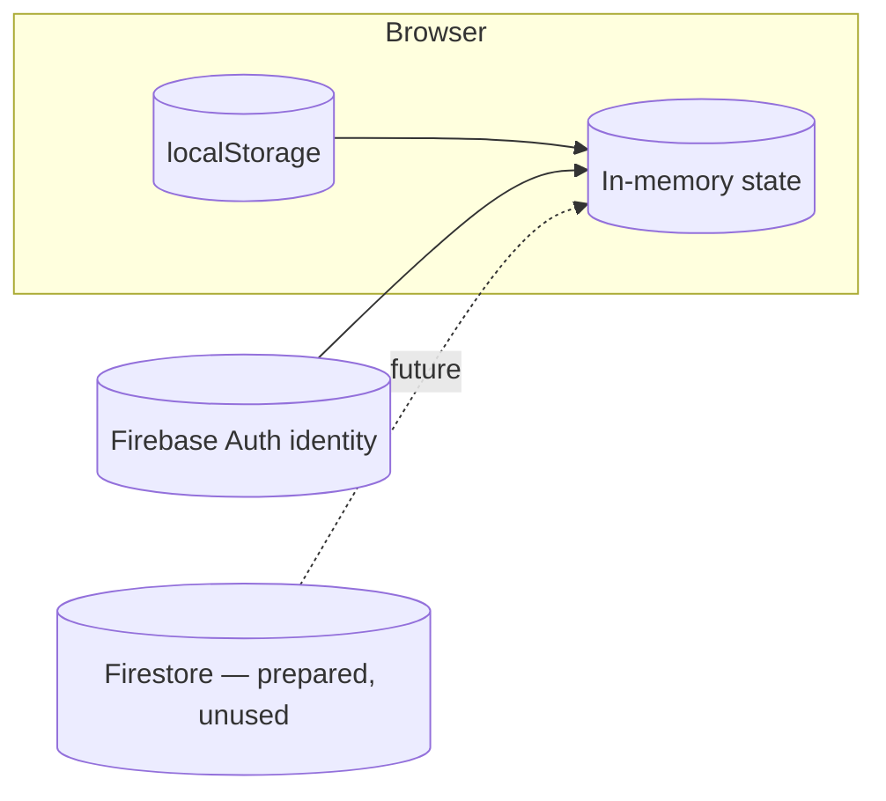
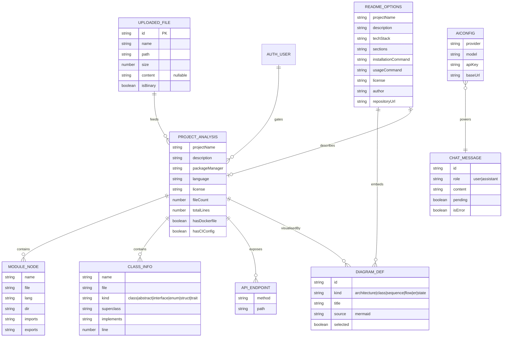

# CogniCode — Database Documentation

> CogniCode is a **database-free** application by design: there is no server-side database and no data persistence beyond the browser. This document describes the actual data layer — browser storage, in-memory domain models, Firebase identity, and the prepared (but currently unused) Firestore schema.

---

## 1. Data Architecture Summary



| Layer | Technology | Status |
| --- | --- | --- |
| Identity | Firebase Auth | **In use** (email/password, Google, GitHub) |
| Key-value settings | `localStorage` | **In use** (AI config, theme) |
| Working data | React state (memory) | **In use** (files, analysis, diagrams, README) |
| Document store | Cloud Firestore | **Prepared only** — rules shipped, no reads/writes in code |

## 2. Browser Storage Schema

### 2.1 `localStorage['cognicode-ai-config']`

```json
{
  "provider": "openai" | "anthropic" | "gemini",
  "model": "gpt-4o-mini",
  "apiKey": "sk-...",
  "baseUrl": "https://your-endpoint/v1"
}
```

- Written by `useAiConfig.save()`; cleared by `useAiConfig.clear()`.
- Read once at mount; falls back to `VITE_AI_*` environment defaults.
- `baseUrl` is optional (OpenAI-compatible relays).

### 2.2 `localStorage['cognicode-theme']`

- `"light"` or `"dark"`.
- Written by `useTheme` on every change; read pre-paint by the inline script in `index.html` (prevents theme flash). System preference (`prefers-color-scheme`) is the fallback when absent.

### 2.3 Firebase Auth session

Managed by the SDK; surfaced as `AuthUser`:

```
AuthUser {
  uid: string
  email: string | null
  displayName: string | null
  photoURL: string | null
  providerData: [{ providerId: 'password' | 'google.com' | 'github.com' }]
}
```

Persistence: `browserLocalPersistence` (remember me) or `browserSessionPersistence` — chosen per login via `loginWithEmail(email, password, rememberMe)`.

## 3. In-Memory Domain Model (the "schema" of the app)

### 3.1 Core entities



All defined in `src/types.ts` (interfaces) — this is the single source of truth for the data model.

### 3.2 Entity lifecycle

| Entity | Created | Destroyed |
| --- | --- | --- |
| `UploadedFile[]` | `commitUpload` / `loadSample` | `handleRemoveFile` / `handleClearFiles` |
| `ProjectAnalysis` | `runAnalysis` | file removal (re-derived) |
| `DiagramDef[]` | `runAnalysis` / `handleRegenerateDiagrams` | file removal |
| `ReadmeOptions` | `DEFAULT_OPTIONS` clone | reset on file removal |
| `readme: string` | `handleGenerate` / `handleAcceptSuggestion` | file removal |
| `ChatMessage[]` | `AssistantPanel` send | panel unmount |

## 4. Firestore Schema (prepared, not yet used)

`firestore.rules` (v2.0.1) defines the intended shape:

```
/databases/{database}/documents
├── users/{uid}          # one document per authenticated user
│     allow read: if request.auth != null && request.auth.uid == uid
│     allow write: if false            # server-side writes only (future)
└── {document=**}        # everything else locked down
```

**Intended `users/{uid}` document (design proposal, not implemented):**

```json
{
  "role": "Member",
  "displayName": "Bornil Mahmud",
  "photoURL": "https://...",
  "preferences": {
    "diagramTheme": "dark",
    "emailNotifications": true
  },
  "savedProjects": [
    { "projectId": "...", "name": "...", "savedAt": "2026-08-05T15:45:42Z" }
  ],
  "createdAt": "...",
  "updatedAt": "..."
}
```

> ⚠️ Do **not** enable Firestore for the app until the client code actually uses it; the rules above intentionally deny all client writes.

## 5. Why No Server Database?

1. **Privacy requirement** — source code stays in the browser; a server DB would contradict the product's core value.
2. **Zero-ops deployment** — no DB provisioning, migrations, or backups for the core feature set.
3. **Auth-only identity** — Firebase Auth already provides durable identity without a companion datastore.
4. **Future needs** (profiles, saved projects, analytics) map cleanly onto Firestore when they arrive — the rules and schema are staged.

## 6. Data Security Notes

- AI API keys persist in `localStorage` in **plain text** — standard for BYO-key browser apps, but any XSS would expose them. Mitigations in place: escaped Markdown rendering, Mermaid `securityLevel: 'strict'`, no third-party scripts.
- Uploaded file contents exist only as JS strings; no caching, no network transmission, no persistence across sessions.
- Firebase config is public by contract; security relies on Firebase project settings (authorized domains, provider toggles) — see `docs/ADMIN_GUIDE.md`.
