# CogniCode — UML & Architecture Diagrams

> All diagrams in this document represent the **actual** v2.0.1 codebase: components, modules, types, flows, and deployments as implemented. Every diagram is provided in **Mermaid** and **PlantUML** form.

---

## Contents

1. [Use Case Diagram](#1-use-case-diagram)
2. [Class Diagram](#2-class-diagram)
3. [ER Diagram](#3-er-diagram)
4. [Sequence Diagram — Analysis & Generation](#4-sequence-diagram--analysis--generation)
5. [Activity Diagram — Generation Pipeline](#5-activity-diagram--generation-pipeline)
6. [Component Diagram](#6-component-diagram)
7. [Deployment Diagram](#7-deployment-diagram)
8. [Package Diagram](#8-package-diagram)
9. [Flowchart — Application Flow](#9-flowchart--application-flow)
10. [System Architecture Diagram](#10-system-architecture-diagram)
11. [Data Flow Diagram (Level 0)](#11-data-flow-diagram-level-0)
12. [Database Relationship Diagram](#12-database-relationship-diagram)
13. [Authentication Flow](#13-authentication-flow)
14. [API Flow — AI Streaming](#14-api-flow--ai-streaming)
15. [Folder Architecture Diagram](#15-folder-architecture-diagram)
16. [State Management Flow](#16-state-management-flow)

---

## 1. Use Case Diagram

**Actors:** Visitor (unauthenticated), User (authenticated), AI Provider (external), Firebase (external).

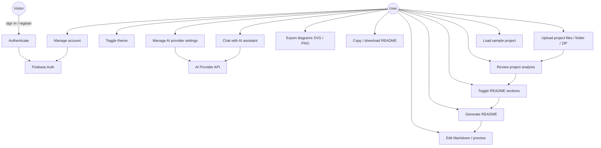

**PlantUML:**

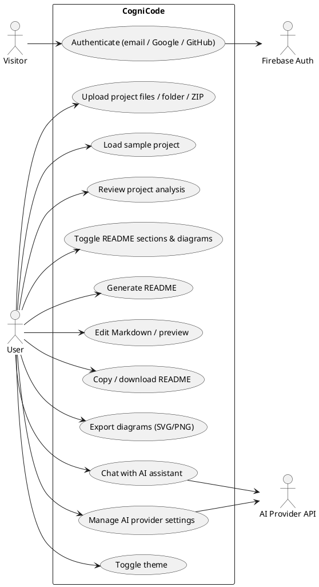

## 2. Class Diagram

Core interfaces/types from `src/types.ts` and the service classes from `src/lib` (names and relationships as implemented).

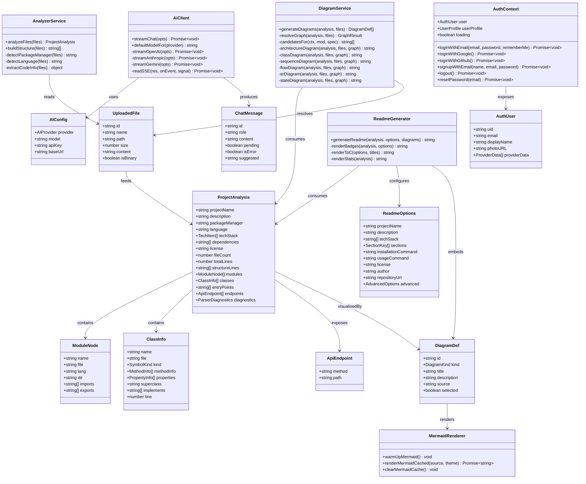

**PlantUML:**

```plantuml
@startuml
class UploadedFile { +string id\n+string name\n+string path\n+number size\n+string content\n+boolean isBinary }
class ProjectAnalysis { +string projectName\n+string language\n+string packageManager\n+number fileCount\n+number totalLines\n+ModuleNode[] modules\n+ClassInfo[] classes\n+ApiEndpoint[] endpoints }
class ModuleNode { +string name\n+string file\n+string lang\n+string dir\n+string[] imports\n+string[] exports }
class ClassInfo { +string name\n+string file\n+SymbolKind kind\n+MethodInfo[] methodInfo\n+PropertyInfo[] properties\n+string superclass\n+string[] implements }
class ApiEndpoint { +string method\n+string path }
class DiagramDef { +string id\n+DiagramKind kind\n+string title\n+string source\n+boolean selected }
class ReadmeOptions { +string projectName\n+string[] sections\n+string installationCommand\n+AdvancedOptions advanced }
class AIConfig { +AIProvider provider\n+string model\n+string apiKey\n+string baseUrl }
class ChatMessage { +string id\n+string role\n+string content\n+boolean pending\n+boolean isError }
class AuthUser { +string uid\n+string email\n+string displayName\n+string photoURL }
class AnalyzerService { +analyzeFiles(files)\n-detectPackageManager(files)\n-detectLanguage(files) }
class DiagramService { +generateDiagrams(analysis, files)\n-resolveGraph(analysis, files)\n-architectureDiagram()\n-classDiagram()\n-sequenceDiagram()\n-flowDiagram()\n-erDiagram()\n-stateDiagram() }
class ReadmeGenerator { +generateReadme(analysis, options, diagrams)\n-renderBadges()\n-renderToC()\n-renderStats() }
class AiClient { +streamChat(opts)\n+defaultModelFor(provider)\n-streamOpenAI()\n-streamAnthropic()\n-streamGemini() }
class MermaidRenderer { +warmUpMermaid()\n+renderMermaidCached(source, theme)\n+clearMermaidCache() }
class AuthContext { +user\n+loading\n+loginWithEmail()\n+loginWithGoogle()\n+loginWithGithub()\n+signupWithEmail()\n+logout() }

UploadedFile --> ProjectAnalysis : feeds
ProjectAnalysis --> ModuleNode : contains
ProjectAnalysis --> ClassInfo : contains
ProjectAnalysis --> ApiEndpoint : exposes
ProjectAnalysis --> DiagramDef : visualisedBy
DiagramDef --> MermaidRenderer : renders
ReadmeGenerator --> ProjectAnalysis : consumes
ReadmeGenerator --> ReadmeOptions : configures
ReadmeGenerator --> DiagramDef : embeds
AiClient --> AIConfig : uses
AiClient --> ChatMessage : produces
AuthContext --> AuthUser : exposes
AnalyzerService --> UploadedFile : reads
DiagramService --> ProjectAnalysis : consumes
@enduml
```

## 3. ER Diagram

Entity-relationship view of the **client-side data model** (no server database exists; see `docs/DATABASE.md`).

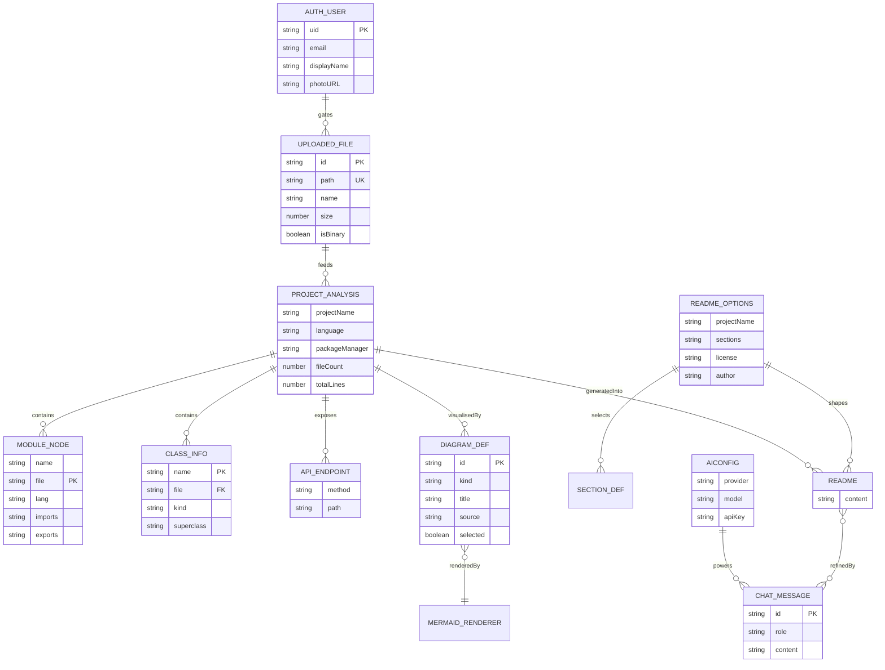

**PlantUML:**

```plantuml
@startuml
!pragma useJpa 1
entity "AUTH_USER" { uid: string <<PK>>\nemail: string\ndisplayName: string }
entity "UPLOADED_FILE" { id: string <<PK>>\npath: string <<UK>>\nsize: number\nisBinary: boolean }
entity "PROJECT_ANALYSIS" { projectName: string\nlanguage: string\npackageManager: string\nfileCount: number\ntotalLines: number }
entity "MODULE_NODE" { name: string\nfile: string <<PK>>\nlang: string\nexports: string[] }
entity "CLASS_INFO" { name: string <<PK>>\nkind: string\nsuperclass: string }
entity "API_ENDPOINT" { method: string\npath: string }
entity "DIAGRAM_DEF" { id: string <<PK>>\nkind: string\nsource: string\nselected: boolean }
entity "README" { content: string }
entity "README_OPTIONS" { projectName: string\nsections: string[]\nlicense: string }
entity "AICONFIG" { provider: string\nmodel: string\napiKey: string }
entity "CHAT_MESSAGE" { id: string <<PK>>\nrole: string\ncontent: string }

AUTH_USER ||--o{ UPLOADED_FILE : gates
UPLOADED_FILE ||--o{ PROJECT_ANALYSIS : feeds
PROJECT_ANALYSIS ||--o{ MODULE_NODE : contains
PROJECT_ANALYSIS ||--o{ CLASS_INFO : contains
PROJECT_ANALYSIS ||--o{ API_ENDPOINT : exposes
PROJECT_ANALYSIS ||--o{ DIAGRAM_DEF : visualisedBy
DIAGRAM_DEF }o--|| README : embeddedIn
README_OPTIONS ||--o{ README : shapes
AICONFIG ||--o{ CHAT_MESSAGE : powers
README }o--o{ CHAT_MESSAGE : refinedBy
@enduml
```

## 4. Sequence Diagram — Analysis & Generation

The real flow through `ProjectUploader` → `App.runAnalysis` → parsers → diagram engine → generator.

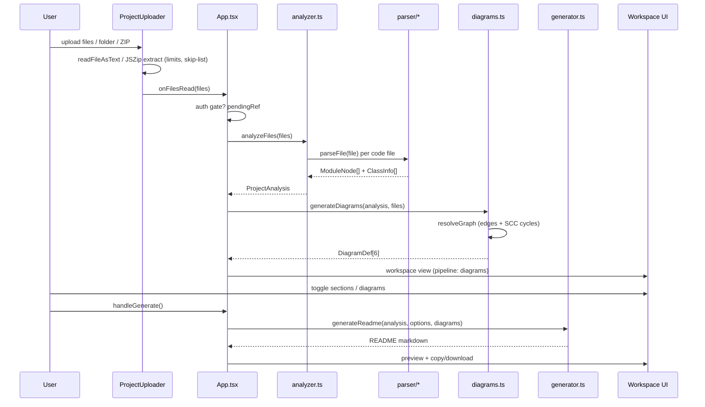

**PlantUML:**

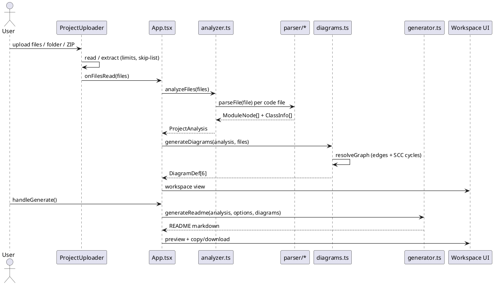

## 5. Activity Diagram — Generation Pipeline

The five-state pipeline from `types.ts` (`upload → analyze → diagrams → build → ready`) with branches.

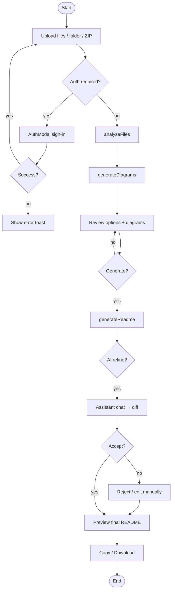

**PlantUML:**

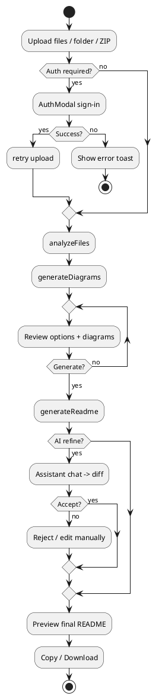

## 6. Component Diagram

Runtime components and their dependencies (as wired in `main.tsx` / `App.tsx`).

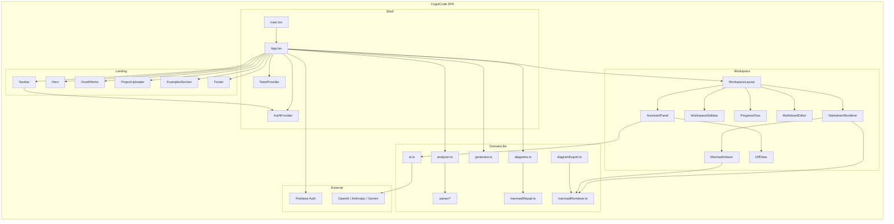

**PlantUML:**

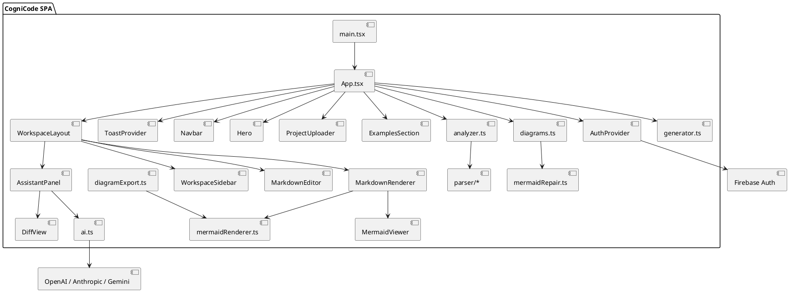

## 7. Deployment Diagram

Two supported topologies; static hosting is recommended.

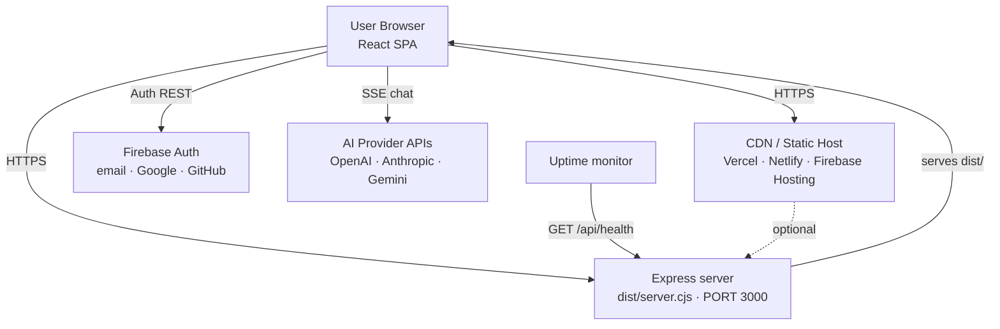

**PlantUML:**

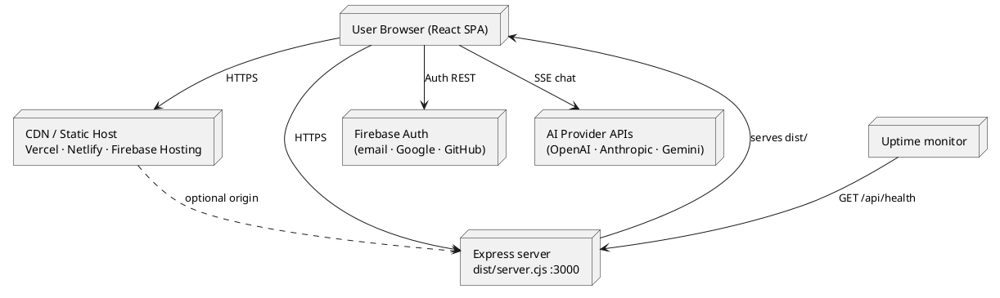

## 8. Package Diagram

Logical grouping of the `src/` packages (folders) and their relationships.

```mermaid
flowchart LR
    subgraph src
        P_APP[pages<br/>Login · Profile · Settings<br/>(reserved)]
        P_COM[components<br/>24 UI components]
        P_CTX[context<br/>AuthContext]
        P_HOOK[hooks<br/>useAuth · useTheme · useAiConfig]
        P_LIB[lib]
        P_DATA[data<br/>sampleProjects]
        P_FB[firebase<br/>firebase.ts]
        P_TYPES[types.ts]
        P_CSS[index.css]
        P_MAIN[main.tsx]
    end
    P_MAIN --> P_APP
    P_MAIN --> P_COM
    P_MAIN --> P_CTX
    P_MAIN --> P_TYPES
    P_CTX --> P_FB
    P_HOOK --> P_CTX
    P_HOOK --> P_LIB
    P_COM --> P_HOOK
    P_COM --> P_LIB
    P_COM --> P_DATA
    P_COM --> P_TYPES
    P_COM --> P_CSS
    subgraph lib
        L_AN[analyzer.ts]
        L_PA[parser]
        L_DG[diagrams.ts]
        L_GE[generator.ts]
        L_AI[ai.ts]
        L_MR[mermaidRenderer.ts · mermaidTheme.ts · mermaidRepair.ts]
        L_DX[diagramExport.ts]
        L_UT[utils.ts]
    end
    L_AN --> L_PA
    L_DG --> L_MR
    L_GE --> L_MR
    L_DX --> L_MR
    P_LIB --> L_AN
    P_LIB --> L_DG
    P_LIB --> L_GE
    P_LIB --> L_AI
```

**PlantUML:**

```plantuml
@startuml
package "src" {
  package "pages (reserved)" {
    [Login] [Profile] [Settings]
  }
  package "components" {
    [24 UI components]
  }
  package "context" { [AuthContext] }
  package "hooks" { [useAuth] [useTheme] [useAiConfig] }
  package "lib" {
    [analyzer.ts] --> [parser]
    [diagrams.ts] --> [mermaidRepair.ts]
    [generator.ts]
    [ai.ts]
    [mermaidRenderer.ts] --> [mermaidTheme.ts]
    [mermaidRenderer.ts] --> [mermaidRepair.ts]
    [diagramExport.ts] --> [mermaidRenderer.ts]
    [utils.ts]
  }
  package "data" { [sampleProjects.ts] }
  package "firebase" { [firebase.ts] }
  [types.ts]
  [main.tsx] --> [components]
  [main.tsx] --> [context]
  [components] --> [hooks]
  [hooks] --> [context]
  [context] --> [firebase]
  [components] --> [lib]
  [components] --> [data]
  [components] --> [types.ts]
}
@enduml
```

## 9. Flowchart — Application Flow

Decision flow of the app from entry to exit (based on `App.tsx` state machine).

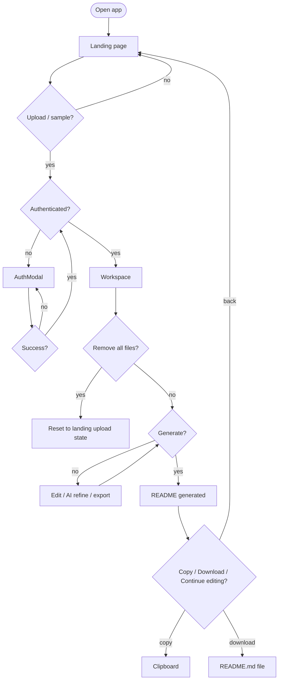

**PlantUML:**

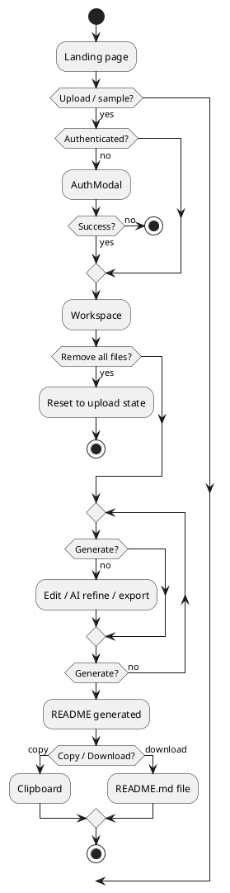

## 10. System Architecture Diagram

End-to-end view: browser layers + optional server + external services.

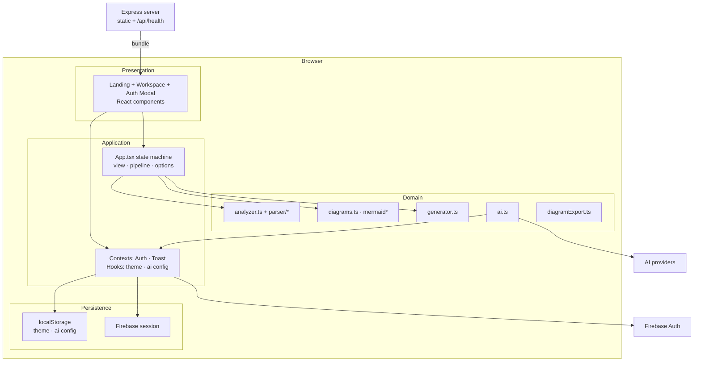

**PlantUML:**

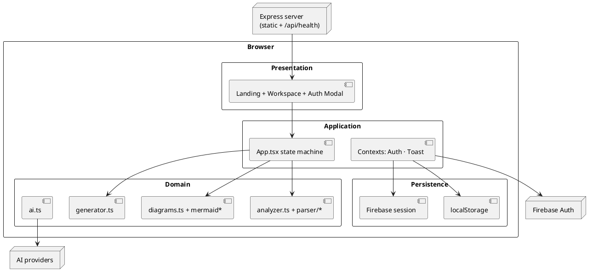

## 11. Data Flow Diagram (Level 0)

Context diagram of the whole system (data stores are browser-local).

```mermaid
flowchart LR
    U[User] -->|files / folder / ZIP| P[Process: CogniCode<br/>analyze → diagram → generate]
    U -->|auth credentials| P
    P -->|README.md| U
    P -->|SVG / PNG| U
    P -->|readme text (optional)| AI[AI Provider]
    AI -->|streamed suggestions| P
    P -->|auth requests| FB[Firebase Auth]
    P <-->|persist theme · ai-config| LS[(localStorage)]
    P <-->|in-memory state| MEM[(UploadedFile[]<br/>ProjectAnalysis<br/>ReadmeOptions)]
```

**PlantUML:**

```plantuml
@startuml
actor User
process "CogniCode\nanalyze → diagram → generate" as P
actor "AI Provider" as AI
actor "Firebase Auth" as FB
database "localStorage" as LS
database "In-memory state" as MEM
User --> P : files / folder / ZIP
User --> P : auth credentials
P --> User : README.md
P --> User : SVG / PNG
P --> AI : readme text (optional)
AI --> P : streamed suggestions
P --> FB : auth requests
P <--> LS : theme · ai-config
P <--> MEM : working data
@enduml
```

## 12. Database Relationship Diagram

Relationships among persistent + in-memory entities (no SQL database).

```mermaid
flowchart LR
    AU[AUTH_USER] -->|gates| UF[UPLOADED_FILE]
    UF -->|feeds| PA[PROJECT_ANALYSIS]
    PA -->|contains| MN[MODULE_NODE]
    PA -->|contains| CI[CLASS_INFO]
    PA -->|exposes| AE[API_ENDPOINT]
    PA -->|visualisedBy| DD[DIAGRAM_DEF]
    DD -->|renderedBy| MR[MERMAID_RENDERER]
    RO[README_OPTIONS] -->|selects| SD[SECTION_DEF]
    PA -->|generatedInto| RD[README]
    RO -->|shapes| RD
    AC[AICONFIG] -->|powers| CM[CHAT_MESSAGE]
    RD -->|refinedBy| CM
```

**PlantUML:**

```plantuml
@startuml
entity "AUTH_USER" as AU
entity "UPLOADED_FILE" as UF
entity "PROJECT_ANALYSIS" as PA
entity "MODULE_NODE" as MN
entity "CLASS_INFO" as CI
entity "API_ENDPOINT" as AE
entity "DIAGRAM_DEF" as DD
entity "README_OPTIONS" as RO
entity "README" as RD
entity "AICONFIG" as AC
entity "CHAT_MESSAGE" as CM

AU ||--o{ UF : gates
UF ||--o{ PA : feeds
PA ||--o{ MN : contains
PA ||--o{ CI : contains
PA ||--o{ AE : exposes
PA ||--o{ DD : visualisedBy
RO ||--o{ RD : shapes
PA ||--o{ RD : generatedInto
AC ||--o{ CM : powers
RD }o--o{ CM : refinedBy
@enduml
```

## 13. Authentication Flow

Actual flow through `AuthModal` → `AuthContext` → Firebase, including the pending-action resume.

```mermaid
sequenceDiagram
    participant U as User
    participant M as AuthModal
    participant F as LoginForm / RegisterForm
    participant C as AuthContext
    participant FA as Firebase Auth
    participant A as App.tsx

    U->>M: open modal (or pending upload)
    M->>F: show form
    U->>F: submit credentials / social
    F->>C: loginWithEmail / loginWithGoogle / loginWithGithub / signupWithEmail
    C->>C: setPersistence(local | session)
    C->>FA: signInWithEmailAndPassword / signInWithPopup / createUserWithEmailAndPassword
    FA-->>C: AuthUser
    C-->>F: success
    F->>M: onSuccess
    M->>A: handleAuthSuccess
    A->>A: replay pendingRef (upload / sample)
    Note over FA,C: onAuthStateChanged keeps AuthUser in sync
    A->>A: view stays in workspace
```

**PlantUML:**

```plantuml
@startuml
actor User
participant "AuthModal" as M
participant "Login/RegisterForm" as F
participant "AuthContext" as C
participant "Firebase Auth" as FA
participant "App.tsx" as A

User -> M : open modal (or pending upload)
M -> F : show form
User -> F : submit credentials / social
F -> C : loginWithEmail / loginWithGoogle / loginWithGithub / signupWithEmail
C -> C : setPersistence(local | session)
C -> FA : signInWithEmailAndPassword / signInWithPopup / createUserWithEmailAndPassword
FA --> C : AuthUser
C --> F : success
F -> M : onSuccess
M -> A : handleAuthSuccess
A -> A : replay pendingRef (upload / sample)
note right of FA : onAuthStateChanged keeps AuthUser in sync
@enduml
```

## 14. API Flow — AI Streaming

The SSE flow in `ai.ts` for all three providers.

```mermaid
sequenceDiagram
    participant U as User
    participant AP as AssistantPanel
    participant AI as ai.ts
    participant P as Provider API

    U->>AP: send message
    AP->>AP: config? no → open settings
    AP->>AI: streamChat({config, system, messages, onToken, signal})
    AI->>P: POST chat/completions | messages | streamGenerateContent (SSE)
    loop stream
        P-->>AI: data: {delta}
        AI-->>AP: onToken(delta)
        AP->>AP: append to assistant message
    end
    P-->>AI: data: [DONE]
    AI-->>AP: resolve
    AP->>AP: looksLikeReadme(full)?
    alt full README suggestion
        AP->>U: DiffView with accept/reject
    else chat reply
        AP->>U: message rendered
    end
    Note over AP,AI: AbortController stops streaming (Stop button)
```

**PlantUML:**

```plantuml
@startuml
actor User
participant "AssistantPanel" as AP
participant "ai.ts" as AI
participant "Provider API" as P

User -> AP : send message
AP -> AP : config? no -> open settings
AP -> AI : streamChat({config, system, messages, onToken, signal})
AI -> P : POST chat/completions | messages | streamGenerateContent (SSE)
loop stream
  P --> AI : data: {delta}
  AI --> AP : onToken(delta)
  AP -> AP : append to assistant message
end
P --> AI : data: [DONE]
AI --> AP : resolve
AP -> AP : looksLikeReadme(full)?
alt full README suggestion
  AP -> User : DiffView with accept/reject
else chat reply
  AP -> User : message rendered
end
@enduml
```

## 15. Folder Architecture Diagram

The actual v2.0.1 folder tree (generated from the repository).

```mermaid
flowchart TD
    CC[cognicode/] --> S[src/]
    CC --> SRV[server.ts]
    CC --> V[ vite.config.ts · tsconfig.json · index.html · preview.html ]
    CC --> CFG[package.json · package-lock.json · .env.example · .gitignore]
    CC --> DOCS[docs/ · firestore.rules · metadata.json]
    S --> SC[components/]
    S --> SCTX[context/]
    S --> SD[data/]
    S --> SF[firebase/]
    S --> SH[hooks/]
    S --> SL[lib/]
    S --> SP[pages/]
    S --> SROOT[App.tsx · main.tsx · types.ts · index.css]
    SC --> SC1[WorkspaceLayout · WorkspaceSidebar · AssistantPanel]
    SC --> SC2[ProjectUploader · MarkdownEditor · MarkdownRenderer]
    SC --> SC3[AuthModal · LoginForm · RegisterForm · ForgotPasswordModal]
    SC --> SC4[Navbar · Hero · HowItWorks · ExamplesSection · Footer]
    SC --> SC5[ResultPanel · DiffView · MermaidViewer · Toast · ProgressFlow]
    SC --> SC6[DocOptionsPanel · ReadmeSettingsModal · AssistantSettingsModal]
    SC --> SC7[Logo · CogniCodeLogo · AuthLayout · ProtectedRoute]
    SCTX --> SCTX1[AuthContext.tsx]
    SD --> SD1[sampleProjects.ts]
    SF --> SF1[firebase.ts]
    SH --> SH1[useAuth.ts · useTheme.ts · useAiConfig.ts]
    SL --> SL1[analyzer.ts · diagrams.ts · generator.ts · ai.ts]
    SL --> SL2[mermaidRenderer.ts · mermaidTheme.ts · mermaidRepair.ts]
    SL --> SL3[diagramExport.ts · utils.ts]
    SL --> SLP[parser/]
    SLP --> SLP1[js · python · go · rust · java · csharp · php · misc · helpers · index]
    SP --> SP1[Login · Profile · Settings (reserved)]
```

**PlantUML:**

```plantuml
@startuml
map "cognicode/" as CC {
  server.ts => Express server
  vite.config.ts => Vite config
  index.html => SPA shell
  preview.html => Standalone preview
  package.json => Manifest
  firestore.rules => Rules
}
map "src/" as S {
  App.tsx => State machine
  main.tsx => Entry
  types.ts => Domain types
  index.css => Design tokens
}
map "components/" as SC { 24 UI components }
map "context/" as SCTX { AuthContext.tsx }
map "data/" as SD { sampleProjects.ts }
map "firebase/" as SF { firebase.ts }
map "hooks/" as SH { useAuth · useTheme · useAiConfig }
map "lib/" as SL { analyzer · diagrams · generator · ai · mermaid* · utils }
map "parser/" as SLP { js · py · go · rs · java · cs · php · misc }
map "pages/" as SP { Login · Profile · Settings }
CC --> S
S --> SC
S --> SCTX
S --> SD
S --> SF
S --> SH
S --> SL
S --> SP
SL --> SLP
@enduml
```

## 16. State Management Flow

How state flows through contexts, hooks, and local component state (React 19; no external state library).

```mermaid
flowchart LR
    subgraph Global
        AC[AuthContext<br/>AuthUser · loading · actions]
        TC[ToastContext<br/>success · error · info]
    end
    subgraph Hooks
        H1[useTheme<br/>localStorage]
        H2[useAiConfig<br/>localStorage]
        H3[useAuth<br/>→ AuthContext]
    end
    subgraph AppState["App.tsx state"]
        V[view: landing | workspace]
        F[files: UploadedFile[]]
        A[analysis: ProjectAnalysis]
        D[diagrams: DiagramDef[]]
        O[options: ReadmeOptions]
        R[readme: string]
        P[pipeline step]
    end
    subgraph Local
        L1[AssistantPanel<br/>messages · streaming]
        L2[ProjectUploader<br/>drag state · reading]
        L3[WorkspaceLayout<br/>drawers · tabs]
    end
    H3 --> AC
    H1 --> V
    H2 --> L1
    AC --> V
    AC --> F
    F --> A --> D
    D --> R
    O --> R
    TC --> L2
    TC --> L1
```

**PlantUML:**

```plantuml
@startuml
package "Global" {
  [AuthContext] as AC
  [ToastContext] as TC
}
package "Hooks" {
  [useTheme\n(localStorage)] as H1
  [useAiConfig\n(localStorage)] as H2
  [useAuth] as H3
}
package "App.tsx state" {
  [view] as V
  [files] as F
  [analysis] as A
  [diagrams] as D
  [options] as O
  [readme] as R
}
package "Local component state" {
  [AssistantPanel\nmessages · streaming] as L1
  [ProjectUploader\ndrag · reading] as L2
  [WorkspaceLayout\ndrawers · tabs] as L3
}
H3 --> AC
H1 --> V
H2 --> L1
AC --> V
AC --> F
F --> A
A --> D
D --> R
O --> R
TC --> L2
TC --> L1
@enduml
```

---

*Diagrams reflect the v2.0.1 codebase. For source-level details see `docs/ARCHITECTURE.md` and `docs/API.md`.*
